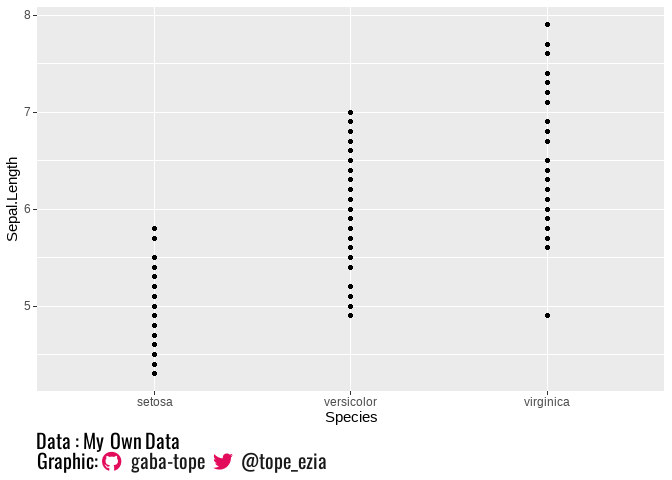

<!-- README.md is generated from README.Rmd. Please edit that file -->

# socialcap

<!-- badges: start -->
<!-- badges: end -->

The `socialcap` package is designed to provide an easy and efficient way
to include social media handles with corresponding icons in the captions
of ggplot2 plots. <br> By using the socialcap function, users can: + Add
their social media usernames (GitHub, Twitter, Facebook, LinkedIn,
Discord) along with stylish icons directly to their plots. + Customize
the appearance of these handles, including text color and font, to match
the aesthetic of their visualizations.

This package was largely inspired from [Nicola
Rennie](https://nrennie.rbind.io/)’s post, [Adding social media icons to
charts with
{ggplot2}](https://nrennie.rbind.io/blog/adding-social-media-icons-ggplot2/).

## Installation

### Installation from GitHub

Developmental version of `socialcap` can be directly installed from
GitHub by executing:

``` r
devtools::install_github("gaba-tope/socialcap")
```

### Loading the Package

After installation, you may load `socialcap` into R session with:

``` r
library(socialcap)
```

You are now ready to use socialcap to enhance your ggplot2
visualizations with social media information.

## Requirement

1.  You need to have ‘Font Awesome Free’ font to make icons appear. You
    may download the font from their
    [website](https://fontawesome.com/download). ‘Font Awesome Free’
    font files follow the [SIL OFL
    license](https://openfontlicense.org/) as explained in their
    [website](https://fontawesome.com/license/free) ( accessed in
    2024-01-18).
2.  The returned string should be written in HTML language. In order to
    apply the string into your plots, the following conditions should be
    met:

- Package {ggtext} should be loaded.
- Package {ggplot2} should be loaded, and your plot should be made with
  `ggplot()`.
- The theme element of the caption should use ggtext elements
  (i.e. `plot.caption = element_textbox_simple()` or
  `plot.caption = element_textbox()`).

## Example

These are basic examples which show you how to use the function
`socialcap()`.

``` r
library(socialcap)
library(showtext)
#> 필요한 패키지를 로딩중입니다: sysfonts
#> 필요한 패키지를 로딩중입니다: showtextdb
library(ggplot2)
library(ggtext)
library(showtext)

## basic example code
social_caption <- socialcap::socialcap(gitname = "gaba-tope", twitname = "@tope_ezia")
social_caption
#> [1] "<span style='font-family:\"Font_Awesome_6_Brands_reg\";'>&#xf099;</span><span style='color: grey10; font-family:\"oswald\";'>@tope_ezia</span>"

data_caption <- "Data : My Own Data"
plot_caption <- paste(data_caption, "<br> Graphic:", social_caption)
## Apply to Plot
df <- data.frame(x = c(1, 2, 3),
                 y = c(4, 5, 6))

font_add_google(name = "Oswald", family = "oswald")
showtext_auto()

plot_ex <- ggplot(data = df, aes(x = x, y = y)) +
  geom_point() +
  labs(caption = plot_caption) +
  theme(plot.caption = element_textbox(size = 15,
                                       family = "oswald",
                                       hjust = 0)
        )

plot_ex
```


